# EEG Brainwave Tutorial - Architecture Diagram

```mermaid
graph TD
    %% HTML Structure Layer
    HTML["index.html - Main Document"] --> Head["HTML Head - Meta & Links"]
    HTML --> Body["HTML Body - Structure"]
    
    Head --> GoogleFonts["Google Fonts - Inter Font Family"]
    Head --> StylesLink["styles.css Link - Stylesheet Reference"]
    
    Body --> Container["Container - Main Wrapper"]
    Container --> Header["Header - Title & Description"]
    Container --> WaveNav["Wave Navigation - Selector Buttons"]
    Container --> MainContent["Main Content - Grid Layout"]
    Container --> TutorialSection["Tutorial Section - Educational Cards"]
    Container --> Footer["Footer - Info Text"]
    
    %% Main Content Structure
    MainContent --> VisualizationPanel["Visualization Panel - Left Column"]
    MainContent --> InfoPanel["Info Panel - Right Column"]
    
    %% Visualization Panel Components
    VisualizationPanel --> EEGDisplay["EEG Display - Canvas Container"]
    VisualizationPanel --> FrequencySpectrum["Frequency Spectrum - Spectrum Canvas"]
    
    EEGDisplay --> EEGCanvas["eegCanvas - Main Visualization"]
    EEGDisplay --> Controls["Controls - Interactive Elements"]
    FrequencySpectrum --> SpectrumCanvas["spectrumCanvas - Frequency Bars"]
    
    Controls --> PlayPauseBtn["Play/Pause Button - Animation Control"]
    Controls --> ResetBtn["Reset Button - Time Reset"]
    Controls --> AmplitudeSlider["Amplitude Slider - Wave Height"]
    Controls --> SpeedSlider["Speed Slider - Animation Speed"]
    
    %% Info Panel Components
    InfoPanel --> WaveInfo["Wave Info - Dynamic Content"]
    InfoPanel --> ElectrodeMap["Electrode Map - SVG Brain Map"]
    
    ElectrodeMap --> BrainSVG["brainSvg - Interactive SVG"]
    BrainSVG --> ElectrodeCircles["Electrode Circles - 21 Positions"]
    BrainSVG --> ElectrodeLegend["Electrode Legend - Color Categories"]
    
    %% CSS Styling Layer
    CSS["styles.css - Styling System"] --> GlobalStyles["Global Styles - Reset & Base"]
    CSS --> LayoutStyles["Layout Styles - Grid & Flexbox"]
    CSS --> ComponentStyles["Component Styles - Individual Elements"]
    CSS --> AnimationStyles["Animation Styles - Transitions & Effects"]
    CSS --> ResponsiveStyles["Responsive Styles - Media Queries"]
    
    %% JavaScript Architecture
    JS["script.js - Main Logic"] --> EEGSimulator["EEGSimulator Class - Core Functionality"]
    JS --> EEGEducation["EEGEducation Class - Learning Features"]
    JS --> InitScript["Initialization - DOMContentLoaded"]
    
    %% EEGSimulator Class Methods
    EEGSimulator --> Constructor["constructor() - Setup & Initialize"]
    EEGSimulator --> SetupCanvas["setupCanvas() - Canvas Configuration"]
    EEGSimulator --> SetupEvents["setupEventListeners() - Event Binding"]
    EEGSimulator --> GenerateWave["generateWaveData() - Wave Configuration"]
    EEGSimulator --> UpdateInfo["updateWaveInfo() - Content Updates"]
    EEGSimulator --> DrawEEG["drawEEG() - Main Rendering"]
    EEGSimulator --> DrawSpectrum["drawSpectrum() - Spectrum Rendering"]
    EEGSimulator --> AnimateLoop["animate() - Animation Loop"]
    EEGSimulator --> ElectrodeInteraction["Electrode Methods - Hover & Tooltip"]
    
    %% EEGEducation Class Methods
    EEGEducation --> EduConstructor["constructor() - Educational Setup"]
    EEGEducation --> WaveComparison["addWaveComparisons() - Comparison Feature"]
    EEGEducation --> QuizFeatures["addQuizFeatures() - Quiz System"]
    EEGEducation --> ShowComparison["showWaveComparison() - Modal Display"]
    EEGEducation --> StartQuiz["startQuiz() - Quiz Logic"]
    
    %% Event Flow Connections
    WaveNav --> SetupEvents
    Controls --> SetupEvents
    ElectrodeCircles --> ElectrodeInteraction
    
    %% Data Flow
    GenerateWave --> WaveData[("Wave Data - Configuration Object")]
    WaveData --> DrawEEG
    WaveData --> DrawSpectrum
    WaveData --> UpdateInfo
    
    %% Canvas Rendering Pipeline
    DrawEEG --> ClearCanvas["clearRect() - Clear Canvas"]
    DrawEEG --> DrawGrid["drawGrid() - Background Grid"]
    DrawEEG --> MultiChannel["Multi-channel Loop - 8 EEG Channels"]
    DrawEEG --> WaveCalculation["Wave Mathematics - Sine + Harmonics"]
    DrawEEG --> DrawTimeMarker["drawTimeMarker() - Time Display"]
    
    MultiChannel --> ChannelLabels["Channel Labels - Fp1, Fp2, F3, F4..."]
    MultiChannel --> Baselines["Baseline Drawing - Reference Lines"]
    MultiChannel --> WaveformPath["Waveform Path - Signal Lines"]
    
    %% Spectrum Rendering
    DrawSpectrum --> FreqBands["Frequency Bands - 5 Wave Types"]
    DrawSpectrum --> BarChart["Bar Chart Rendering - Visual Bars"]
    DrawSpectrum --> PulseAnimation["Pulse Animation - Active Wave Highlight"]
    
    %% Mathematical Wave Generation
    WaveCalculation --> SineWave["Fundamental Sine - sin t × frequency"]
    WaveCalculation --> Harmonics["Harmonic Overlay - 2nd & 3rd Harmonics"]
    WaveCalculation --> NoiseGeneration["Random Noise - Realistic Variation"]
    WaveCalculation --> PhaseShift["Channel Phase Shift - Inter-channel Variation"]
    
    %% Educational Features
    WaveComparison --> ComparisonModal["Comparison Modal - Dynamic Table"]
    QuizFeatures --> QuizModal["Quiz Modal - Interactive Questions"]
    QuizModal --> ScoreTracking["Score Tracking - Progress Management"]
    
    %% Electrode Interaction System
    ElectrodeInteraction --> HighlightElectrode["highlightElectrode() - Visual Highlight"]
    ElectrodeInteraction --> ShowTooltip["showElectrodeTooltip() - Info Display"]
    ElectrodeInteraction --> ClearHighlight["clearElectrodeHighlight() - State Cleanup"]
    
    %% Animation System
    AnimateLoop --> RequestAnimationFrame["requestAnimationFrame - 60fps Loop"]
    AnimateLoop --> TimeUpdate["Time Increment - Based on Speed"]
    AnimateLoop --> ConditionalUpdate["Conditional Updates - Play/Pause State"]
    
    %% State Management
    StateManagement[("Application State - Central Data")] --> IsPlaying["isPlaying - Animation State"]
    StateManagement --> CurrentWave["currentWave - Active Wave Type"]
    StateManagement --> TimeValue["time - Current Time"]
    StateManagement --> AmplitudeValue["amplitude - Wave Height"]
    StateManagement --> SpeedValue["speed - Animation Speed"]
    
    %% External Dependencies
    ExternalDeps["External Dependencies - Third-party Resources"] --> GoogleFonts
    ExternalDeps --> CanvasAPI["Canvas 2D API - Drawing Functions"]
    ExternalDeps --> DOMEvents["DOM Events - User Interactions"]
    ExternalDeps --> RequestAnimFrame["RequestAnimationFrame - Browser Animation API"]
    
    %% File Connections
    HTML -.->|references| CSS
    HTML -.->|includes| JS
    
    %% Runtime Connections
    InitScript --> EEGSimulator
    InitScript --> EEGEducation
    EEGSimulator -.->|updates| WaveInfo
    SetupEvents -.->|binds to| Controls
    SetupEvents -.->|binds to| WaveNav
    SetupEvents -.->|binds to| ElectrodeCircles
    
    %% Styling Connections
    CSS -.->|styles| HTML
    CSS -.->|styles| EEGCanvas
    CSS -.->|styles| SpectrumCanvas
    CSS -.->|styles| BrainSVG
    CSS -.->|styles| Controls
    CSS -.->|styles| WaveNav
    
    %% Color Coding
    classDef htmlClass fill:#e1f5fe,stroke:#01579b,stroke-width:2px
    classDef cssClass fill:#f3e5f5,stroke:#4a148c,stroke-width:2px
    classDef jsClass fill:#e8f5e8,stroke:#1b5e20,stroke-width:2px
    classDef canvasClass fill:#fff3e0,stroke:#e65100,stroke-width:2px
    classDef stateClass fill:#fce4ec,stroke:#880e4f,stroke-width:2px
    classDef eventClass fill:#f1f8e9,stroke:#33691e,stroke-width:2px
    
    class HTML,Head,Body,Container,Header,WaveNav,MainContent,TutorialSection,Footer,VisualizationPanel,InfoPanel,EEGDisplay,FrequencySpectrum,Controls,WaveInfo,ElectrodeMap htmlClass
    class CSS,GlobalStyles,LayoutStyles,ComponentStyles,AnimationStyles,ResponsiveStyles cssClass
    class JS,EEGSimulator,EEGEducation,InitScript,Constructor,SetupCanvas,SetupEvents,GenerateWave,UpdateInfo,DrawEEG,DrawSpectrum,AnimateLoop,ElectrodeInteraction jsClass
    class EEGCanvas,SpectrumCanvas,BrainSVG,ClearCanvas,DrawGrid,MultiChannel,WaveCalculation,DrawTimeMarker canvasClass
    class StateManagement,IsPlaying,CurrentWave,TimeValue,AmplitudeValue,SpeedValue,WaveData stateClass
    class PlayPauseBtn,ResetBtn,AmplitudeSlider,SpeedSlider,ElectrodeCircles,WaveComparison,QuizFeatures eventClass
```

## Architecture Overview

This Mermaid diagram illustrates the comprehensive architecture of the EEG Brainwave Tutorial project, showing:

### 🏗️ **Structural Layers**
- **HTML Layer**: Document structure, semantic elements, and UI components
- **CSS Layer**: Styling system with responsive design and animations  
- **JavaScript Layer**: Two main classes handling core functionality and education

### 🔄 **Data Flow**
- User interactions flow through event listeners
- State changes trigger UI updates and canvas redraws
- Mathematical calculations drive realistic wave generation

### 🎨 **Rendering Pipeline**
- Canvas-based visualization with optimized drawing operations
- Real-time animation using requestAnimationFrame
- Multi-channel EEG display with mathematical wave synthesis

### 🎓 **Educational Features**
- Interactive electrode mapping with tooltips
- Comparison modals and quiz systems
- Dynamic content updates based on selected wave types

### 🎯 **Key Connections**
- Event-driven architecture connecting UI to functionality
- State management coordinating between different components
- Modular class design enabling easy feature extensions

The diagram uses color coding to distinguish different architectural layers and shows both structural relationships and runtime data flow patterns.