# EEG Brainwave Tutorial Web App - Architecture Diagram

```mermaid
graph TB
    subgraph "Client Layer - Browser"
        HTML[index.html<br/>Main HTML Document]
        CSS[styles.css<br/>Styling & Layout]
        JS[script.js<br/>Application Logic]
    end

    subgraph "User Interface Components"
        Header[Header Section<br/>Title & Description]
        WaveSelector[Wave Selector Nav<br/>5 Wave Type Buttons]
        MainContent[Main Content Area]
        Tutorial[Tutorial Section<br/>Educational Cards]
        Footer[Footer]
    end

    subgraph "Main Content Panels"
        VisPanel[Visualization Panel]
        InfoPanel[Information Panel]
    end

    subgraph "Visualization Components"
        EEGCanvas[EEG Canvas<br/>800x400px<br/>Live Waveform Display]
        SpectrumCanvas[Spectrum Canvas<br/>400x300px<br/>Frequency Bars]
        Controls[Control Panel<br/>Play/Pause/Reset/Show All]
        AmplitudeSlider[Amplitude Control<br/>Range: 10-100]
        SpeedSlider[Speed Control<br/>Range: 0.1-3x]
    end

    subgraph "Information Components"
        WaveInfo[Wave Information Display<br/>Dynamic Content]
        ElectrodeMap[EEG Electrode Map<br/>SVG 10-20 System]
        ElectrodeLegend[Electrode Legend<br/>Color-coded Regions]
    end

    subgraph "Core Classes - JavaScript"
        EEGSim[EEGSimulator Class<br/>Main Controller]
        EEGEdu[EEGEducation Class<br/>Educational Features]
    end

    subgraph "EEGSimulator Methods & Properties"
        Props[Properties:<br/>- canvas, ctx<br/>- spectrumCanvas, spectrumCtx<br/>- isPlaying, time<br/>- amplitude, speed<br/>- currentWave<br/>- showAllWaves]
        
        Setup[Setup Methods:<br/>- setupCanvas<br/>- setupEventListeners]
        
        Data[Data Generation:<br/>- generateWaveData<br/>- generateAllWaveData<br/>- updateWaveInfo]
        
        Drawing[Drawing Methods:<br/>- drawEEG<br/>- drawSingleWave<br/>- drawAllWaves<br/>- drawGrid<br/>- drawTimeMarker<br/>- drawSpectrum]
        
        Interaction[Interaction Methods:<br/>- highlightElectrode<br/>- clearElectrodeHighlight<br/>- showElectrodeTooltip<br/>- hideElectrodeTooltip]
        
        Animation[Animation Loop:<br/>- animate]
    end

    subgraph "EEGEducation Methods"
        CompareWaves[addWaveComparisons<br/>showWaveComparison]
        Quiz[addQuizFeatures<br/>startQuiz]
    end

    subgraph "Data Models"
        WaveTypes[Wave Type Definitions:<br/>- Delta: 2Hz, Green<br/>- Theta: 6Hz, Blue<br/>- Alpha: 10Hz, Orange<br/>- Beta: 20Hz, Purple<br/>- Gamma: 50Hz, Pink]
        
        WaveInfo[Wave Information:<br/>- name, frequency<br/>- amplitude, state<br/>- description<br/>- clinical significance]
        
        ElectrodeData[Electrode Positions:<br/>- Fp1, Fp2, Fpz<br/>- F3, F4, F7, F8, Fz<br/>- C3, C4, Cz, T3, T4<br/>- P3, P4, Pz, T5, T6<br/>- O1, O2, Oz]
    end

    subgraph "Event Flow"
        UserEvents[User Interactions:<br/>- Button Clicks<br/>- Slider Changes<br/>- Electrode Hover]
        
        StateChanges[State Updates:<br/>- Wave Selection<br/>- Play/Pause Toggle<br/>- Amplitude/Speed Change<br/>- All Waves Toggle]
        
        Rendering[Visual Updates:<br/>- Canvas Redraw<br/>- Spectrum Update<br/>- Info Panel Update<br/>- Electrode Highlight]
    end

    subgraph "External Dependencies"
        Fonts[Google Fonts<br/>Inter Font Family]
        Canvas2D[HTML5 Canvas API<br/>2D Rendering Context]
        RequestAnim[requestAnimationFrame<br/>Animation Loop]
    end

    subgraph "Visual Rendering Pipeline"
        Frame[Animation Frame]
        ClearCanvas[Clear Canvas]
        DrawGrid[Draw Grid Lines]
        DrawWaveform[Draw Waveform<br/>Single or All Waves]
        DrawMarkers[Draw Time Markers]
        DrawFreqSpectrum[Draw Frequency Spectrum]
    end

    %% Main Structure Connections
    HTML --> Header
    HTML --> WaveSelector
    HTML --> MainContent
    HTML --> Tutorial
    HTML --> Footer
    
    MainContent --> VisPanel
    MainContent --> InfoPanel
    
    VisPanel --> EEGCanvas
    VisPanel --> SpectrumCanvas
    VisPanel --> Controls
    VisPanel --> AmplitudeSlider
    VisPanel --> SpeedSlider
    
    InfoPanel --> WaveInfo
    InfoPanel --> ElectrodeMap
    InfoPanel --> ElectrodeLegend
    
    %% Script Connections
    JS --> EEGSim
    JS --> EEGEdu
    
    EEGSim --> Props
    EEGSim --> Setup
    EEGSim --> Data
    EEGSim --> Drawing
    EEGSim --> Interaction
    EEGSim --> Animation
    
    EEGEdu --> CompareWaves
    EEGEdu --> Quiz
    
    %% Data Flow
    WaveTypes --> Data
    WaveInfo --> Data
    ElectrodeData --> ElectrodeMap
    
    Setup --> UserEvents
    UserEvents --> StateChanges
    StateChanges --> Rendering
    
    %% Rendering Pipeline
    Animation --> Frame
    Frame --> ClearCanvas
    ClearCanvas --> DrawGrid
    DrawGrid --> DrawWaveform
    DrawWaveform --> DrawMarkers
    DrawMarkers --> DrawFreqSpectrum
    DrawFreqSpectrum --> Frame
    
    %% External Dependencies
    Fonts --> CSS
    Canvas2D --> Drawing
    RequestAnim --> Animation
    
    %% Styling
    CSS --> Header
    CSS --> WaveSelector
    CSS --> VisPanel
    CSS --> InfoPanel
    CSS --> Tutorial
    
    %% User Interaction Flow
    WaveSelector -.->|Click Event| StateChanges
    Controls -.->|Click Event| StateChanges
    AmplitudeSlider -.->|Input Event| StateChanges
    SpeedSlider -.->|Input Event| StateChanges
    ElectrodeMap -.->|Hover Event| Interaction
    
    %% Data Updates
    StateChanges -.->|Update Wave| Data
    Data -.->|Update Info| WaveInfo
    Data -.->|Update Canvas| Drawing
    
    style EEGSim fill:#4CAF50,stroke:#2E7D32,stroke-width:3px,color:#fff
    style EEGEdu fill:#2196F3,stroke:#1565C0,stroke-width:3px,color:#fff
    style EEGCanvas fill:#FF9800,stroke:#E65100,stroke-width:2px
    style SpectrumCanvas fill:#9C27B0,stroke:#6A1B9A,stroke-width:2px
    style WaveInfo fill:#E91E63,stroke:#AD1457,stroke-width:2px
    style ElectrodeMap fill:#00BCD4,stroke:#00838F,stroke-width:2px
```

## Architecture Overview

### Layer Structure

1. **Presentation Layer** (HTML/CSS)
   - Semantic HTML5 structure
   - Responsive CSS with gradients
   - Google Fonts integration

2. **Application Layer** (JavaScript)
   - Object-oriented design with 2 main classes
   - Event-driven architecture
   - Real-time canvas rendering

3. **Data Layer**
   - In-memory wave type definitions
   - Dynamic wave information
   - Electrode mapping system

### Key Components

#### EEGSimulator Class
- **Responsibility**: Core simulation engine
- **Manages**: Canvas rendering, animation, wave generation
- **Features**:
  - Dual canvas system (EEG + Spectrum)
  - Multi-channel waveform display
  - Real-time parameter adjustment
  - Interactive electrode system

#### EEGEducation Class
- **Responsibility**: Educational features
- **Manages**: Comparison tools, quiz system
- **Features**:
  - Wave comparison modal
  - Interactive quiz system
  - Educational content display

### Data Flow

1. **User Input** → Wave button clicked
2. **Event Handler** → Updates `currentWave` state
3. **Data Generator** → Generates new wave parameters
4. **Update Method** → Updates info panel content
5. **Animation Loop** → Renders updated visualization
6. **Canvas Output** → Displays new waveform

### Rendering Pipeline

1. **requestAnimationFrame** triggers animation loop
2. **Clear** previous frame from canvas
3. **Draw Grid** background reference lines
4. **Draw Waveforms** (single or composite view)
5. **Draw Markers** (time, frequency labels)
6. **Draw Spectrum** frequency band visualization
7. **Repeat** at 60 FPS

### Interactive Features

- **5 Wave Types**: Delta, Theta, Alpha, Beta, Gamma
- **Real-time Controls**: Play/Pause, Reset, Show All Waves
- **Parameter Adjustment**: Amplitude (10-100), Speed (0.1-3x)
- **Electrode System**: 21 electrodes with hover tooltips
- **Educational Tools**: Wave comparison chart, knowledge quiz
- **Dual View Modes**: Single wave or combined wave display

### Technical Specifications

- **Canvas Resolution**: 800x400px (EEG), 400x300px (Spectrum)
- **Animation Rate**: ~60 FPS via requestAnimationFrame
- **Wave Frequencies**: 0.5-100 Hz range
- **Electrode System**: 10-20 International System
- **Color Scheme**: Material Design color palette
